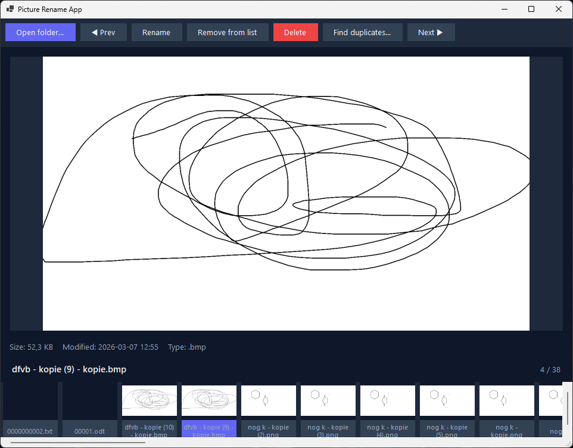
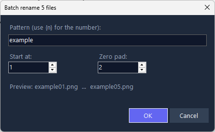
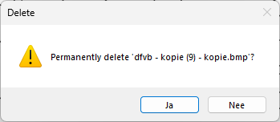

# Picture Rename App

[]()
[]()

A lightweight, fast Windows desktop application (WinForms) for browsing, previewing, and renaming image files. Picture Rename App simplifies single and batch renaming, helps find duplicates, and supports safe file operations with clear user confirmations.

Target platform: Windows (WinForms), .NET 8

---

## Overview

Picture Rename App provides a simple, focused UI to:

- Browse directories and view image thumbnails
- Preview images and view metadata
- Rename a single file or perform batch renames with automatic numbering
- Optionally move batch-renamed files into a dedicated subfolder named after the chosen base name
- Remove files from the current list or permanently delete them from disk (prompted)
- Detect duplicate files and manage them

The project emphasizes reliability, predictable behavior, and efficient memory use when handling large image collections. The codebase follows a service-oriented design (image, file, logger services), centralized configuration, and safe UI threading patterns.

---

## Screenshots

Place GUI screenshots in the `screenshots/` directory. The README references the following images (add real screenshots there):

- `screenshots/main.svg` — main application window (thumbnail strip + preview)
- `screenshots/open-folder.svg` — folder selection and thumbnail loading
- `screenshots/batch-rename.svg` — batch rename dialog and example
- `screenshots/confirm-remove.svg` — remove vs delete prompt

Example markdown to show screenshots (these images are not included by default):








Mock screenshots are included in the `screenshots/` folder as SVG placeholders. To replace them with real captures:

1. Create a `screenshots` folder at the repository root (already present).
2. Replace the corresponding SVG files with PNG or SVG screenshots from your machine (recommended resolution ~1366x768).
3. Commit the images to the repository.

The repository currently contains SVG mock images you can use as examples or replace with real screenshots.

---

## Quick Start (Developer)

### Prerequisites

- .NET 8 SDK
- Windows (WinForms desktop application)
- Optional: Visual Studio 2022/2023 or Visual Studio Code

### Build and run

```bash
# Restore and build
dotnet restore
dotnet build

# Run the application
dotnet run --project PictureRenameApp.csproj
```

Alternatively, open the project in Visual Studio and run the `PictureRenameApp` project.

### Run tests

If a test project is configured:

```bash
dotnet test
```

---

## Usage (End-user)

1. Click **Open folder…** to choose a directory with images.
2. Thumbnails are generated; click any thumbnail to preview the image and metadata.
3. Use **Rename** for single or batch renames. For batch renames, the renamed files are placed into a subfolder named after your base name (optional behavior available in settings).
4. Use **Remove** to remove files from the displayed list — a prompt lets you choose to remove (keep on disk) or delete (permanently remove from disk).
5. Use **Find duplicates…** to scan for and manage duplicates.

Notes

- Deleting files is permanent; the app will confirm before deleting.
- Batch renames move files into `./<BaseName>/` inside the active directory by default.

---

## Architecture (Developer)

Key locations in the codebase:

- `Controllers/` — `ApplicationController` orchestrates operations and updates the model
- `Services/` — `ImageService`, `FileService`, `ApplicationLogger`
- `Utilities/` — extension methods and `LRUCache`
- `Configuration/AppConstants.cs` — centralized constants
- `MainForm.cs` — WinForms UI (thumbnail strip, preview, toolbar)
- `Program.cs` — application entry point

Design highlights:

- Service-oriented architecture: image, file, and logging responsibilities are separated for testability
- Centralized constants and extensions to avoid duplication and magic numbers
- Controlled concurrency for thumbnail generation to keep the UI responsive

---

## Notable Behaviors

- Batch rename: creates a subfolder with the chosen base name and moves renamed files into it
- Remove action: prompts to either remove from list or permanently delete; the delete path confirms again before removing files
- Thumbnail generation: optimized for speed and memory using controlled concurrency and lower-quality rendering suitable for thumbnails

---

## Contributing

Contributions are welcome. Please follow standard GitHub workflow:

1. Fork the repository
2. Create a branch for your feature or bugfix
3. Add tests and update documentation where appropriate
4. Run `dotnet build` and `dotnet test`
5. Submit a pull request

Please add a `CONTRIBUTING.md` if you want project-specific contributor guidelines.

---

## License

See the `LICENSE` file in the repository for license details.

---

## Contact / Support

If you need support or want to report an issue, open an issue in this repository. Include screenshots and steps to reproduce the problem.

---

